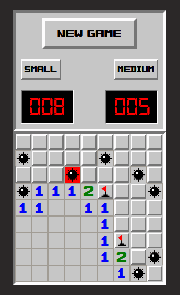

# Minesweeper

### About The Project
[Minesweeper](https://en.wikipedia.org/wiki/Minesweeper_(video_game)) is a logic puzzle game created by Microsoft in the 1990s. Modeled on the original game, this version is built with HTML, SCSS and JavaScript, and is played in the browser.
 

### Live version [here](https://amy-minesweeper.netlify.app/).

## Gameplay screenshots
There are 3 board sizes: 9x9, 16x16 and 30x16, the same sizes as the traditional game:

  
  &nbsp;
  
  &nbsp;
  

   

Example gameplay for each board size:

  
  &nbsp;
  
  &nbsp;
  

## Issues
There are no known issues; if you find a bug, feel free to open an issue [here](https://github.com/AmyMaule/minesweeper/issues/new), including as much information as you can. 

## License
MIT © [Amy Maule](https://github.com/AmyMaule)